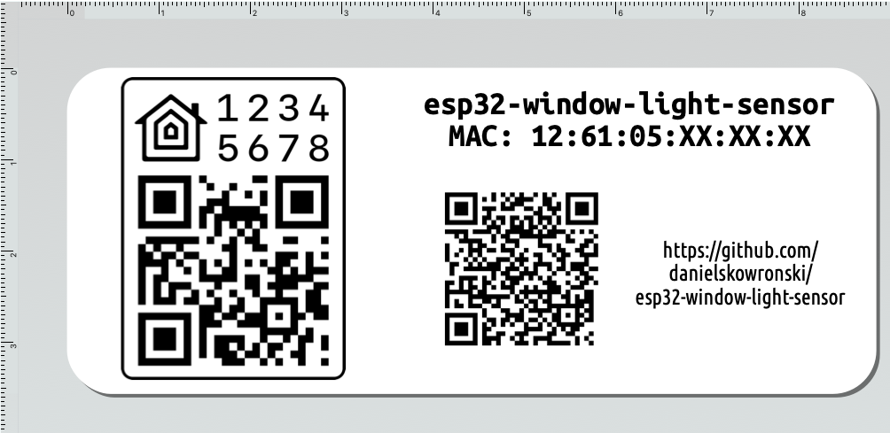

# ESP32 based Window Light Sensor with HomeKit and MQTT support

Used as a sensor for automatic shades closure when it's too bright for delicate eyes of nerd. Added temperature sensor as cheap addition to I2C bus.

HomeKit for automation, MQTT for reporting to HomeAssistant. 

## Software

Arduino sketch - [./software/esp32-window-light-sensor/](./software/esp32-window-light-sensor/)

### Libraries

- ESP32 v2.0.5
- HomeSpan
    - until https://github.com/HomeSpan/HomeSpan/issues/414 is resolved, fork https://github.com/danielskowronski/HomeSpan is required for "upgraded" Home
- BH1750 v1.3.0
- BMP280 v2.6.6

## Hardware

ESP32 board connected to light and temperature sensors via ribbon cable - [./hardware/HARDWARE.md](./hardware/HARDWARE.md)

## Usage

### HomeKit

Follow [HomeSpan User Guide](https://github.com/HomeSpan/HomeSpan/blob/master/docs/UserGuide.md)

### MQTT

TBD (not yet implemented)

### Label

To get label like this, follow [./label/LABEL.md](./label/LABEL.md)

