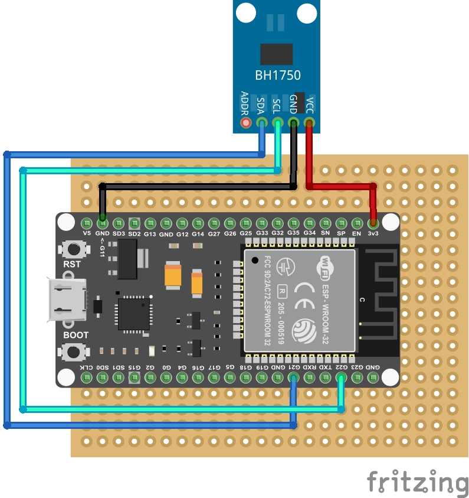

# Hardware

## Bill of Materials

- MCU: ESP32 Dev Board - see [MCU.md](MCU.md)
- light sensor: BH1750
- 5x7cm double-sided prototype board
- IDC10 board connector
- IDC10 terminated cable to be routed at edge of window glass (so it can be behind shades), 3m
- plastic case - Kradex Z34B

### Light sensor selection

- photoresistor: random accuracy, external ADC required
- phototransistor TEMT6000: <570nm, external ADC required
- BH1750: cheap, +/-20% accurate
- TSL2581FN: more precise, but no ready-made integration, not easily available in reasonable package
- TSL25911: seems the best, but not easily available at all

## Schematic

Fritzing project: [esp32-lightsensor.fzz](esp32-lightsensor.fzz)

