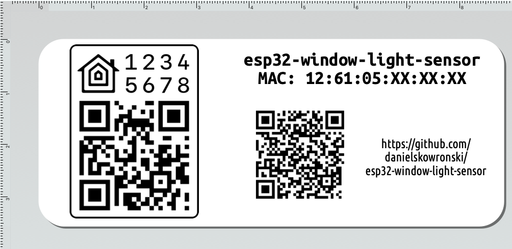

## Label

This document shows how to prepare 36x89mm (*Large Address*) DYMO Label that can be sticked to top of proposed case - Kradex Z34B. It assumes you use ***DYMO Label*** software and have *label* printer connected.

It'll look like that: 



### Instructions

1. First, set up HomeKit Pairing Code (default from HomeSpan is 466-37-726). To do so, connect via serial and issue `S 12345678` where `12345678` is desired code.
   You'll get confirmation and line saying: `Setup Payload for Optional QR Code: X-HM://XXXXXXXXXAAAA`. You'll need to get that `AAAA` part as this is `setupId`.
1. Next step is to get MAC address of the ESP32 board, which in this project is set as HomeKit device Serial Number. 
   Issue command `i` over serial and look for like `Characteristic SerialNumber`.
1. Then, you can generate HomeKit Label. NPM package `homekit-code` seems the easiest one to do the job.
   ```bash
   npx homekit-code qrcode --category=bridge --pairingCode=12345678 --setupId=AAAA --name=esp32-window-light-sensor --output=png
   ```
1. After that, open [./label.label](./label.label) with ***DYMO Label***.
    1. Replace HomeKit QR code by copying contents of `esp32-window-light-sensor.png`, double clicking on image in DYMO Label and selecting *clipboard* as image source. 
    1. Replace MAC address on Text object.
    1. Print it. 
